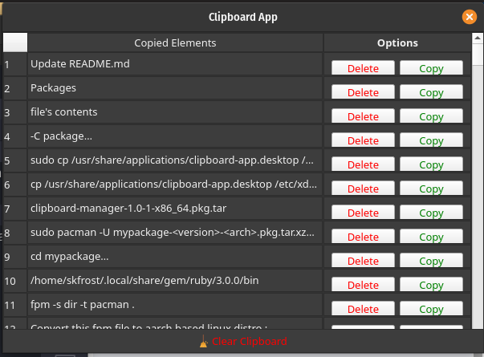

# Clipboard App - Package branch

## Demo



## Steps to build a package :-

- [optional] - Create a virtual environment

## Install Necessary library/tools :-

- pip3 install -r requirements.txt
- pip3 install PyInstaller
- sudo apt install ruby
- gem install fpm --user-install (If you see a warning e.g. You don't have /home/martin/.local/share/gem/ruby/2.7.0/bin in your PATH you will need to add that to your path in your .bashrc file. check fpm --version)

`Next, use pyinstaller and fpm to build a package file (run the following in the terminal, also make sure to grant executables permission to sh files.) :-`

- pyinstaller Clipboard-App.spec
- ./package.sh

## Build on a debian based system :-

- fpm

## Build on a rpm based system :-

- Replace the .fpm file's contents with the following :-

```
-C package
-s dir
-t rpm
-n "clipboard-manager"
-v 1.0.0
-p clipboard-manager.rpm
```

- fpm

## Build on arch based system :-

- Replace the .fpm file's contents with the following :-

```
-C package
-s dir
-t pacman
-n "clipboard-manager"
-v 1.0.0
```

- fpm
